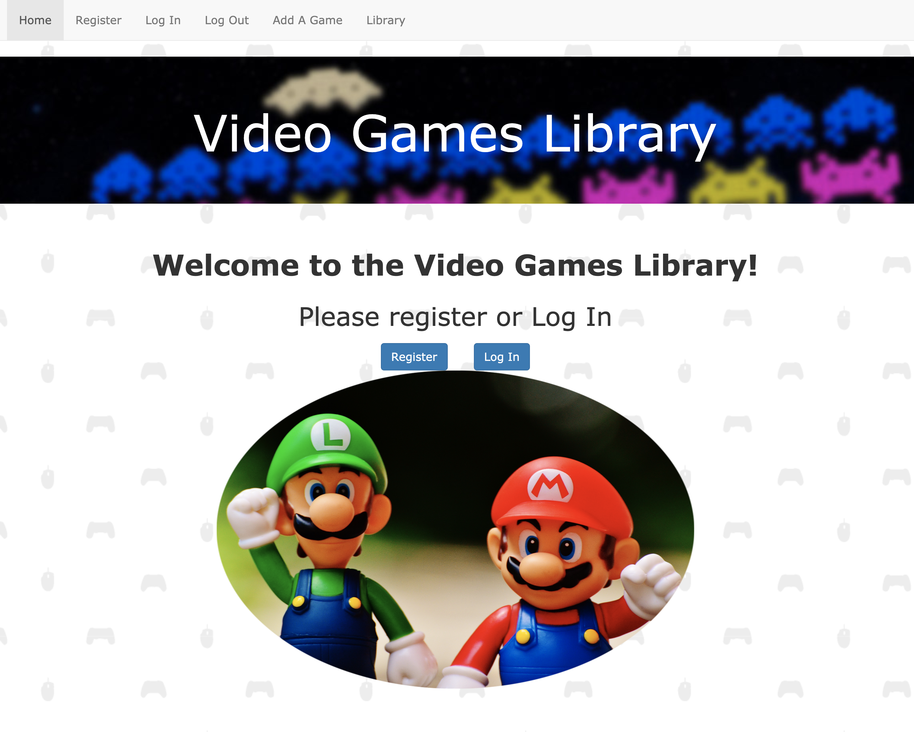
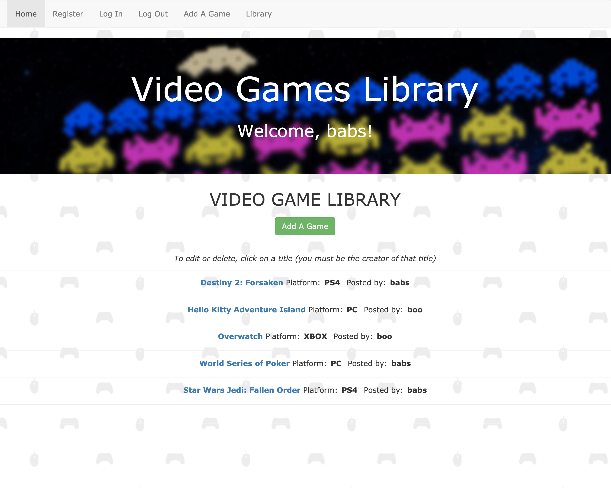
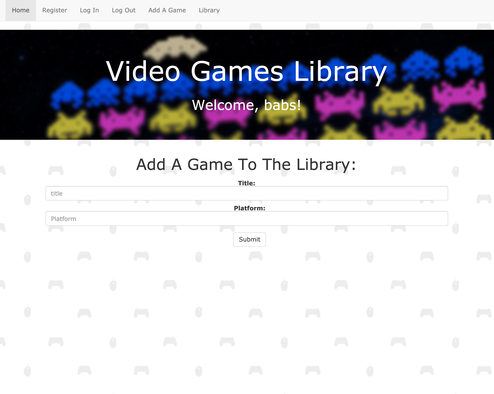

# Video Games Library

Welcome to *Video Games Library*, a Sinatra Web App where you can create and share your video game collection. 

  

In Video Games Library, a user can:
 - create a secure account
 - log in with secure user session
 - create, read, edit, and delete game titles

 A user cannot:
 - edit or delete other users' entries
 - see or interact with the library when logged out
 - log in without registration 

## Installation

 From your terminal, you can clone and install this app by running:  
 git clone ` https://github.com/SilverBright/video-games-library-sinatra-project `

Change directory to `video-games-library`, and run the following:

```ruby
bundle install
rake db:migrate
```
To start the app, run:
```
shotgun
```

## Instructions

- Create a new account and log in 
- You will be redirected to the main index page where you can see a list of video games added by other users
- Select 'Add a game' to add a game title, and platform, then click 'submit'
- From here, you can edit or delete your entry, add a new game, or go to the Library
- To edit or delete your game from the Library, simply click directly on the title, which will redirect you to an edit screen

## Specs

- Built with Sinatra
- ActiveRecord for persistence 
- Register / login / logout capability
- bcrypt for password security
- CRUD operations, MVC structure, and RESTful routes
- Validations with Flash error or success messaging
- Navbar for quick and easy navigation
- Bootstrap for simple, responsive styling

## Contributing

Bug reports and pull requests are welcome on GitHub.  This project is intended to be a safe, welcoming space for collaboration, and contributors are expected to adhere to the [Contributor Covenant](http://contributor-covenant.org) code of conduct.

## License

The app is available as open source under the terms of the [MIT License](https://github.com/SilverBright/Video-Games-Library/blob/master/LICENSE).

## Credits

Bootstrap references were obtained from [here](https://getbootstrap.com).  
Project structure developed with Corneal, a Sinatra app generator: https://github.com/thebrianemory/corneal.
